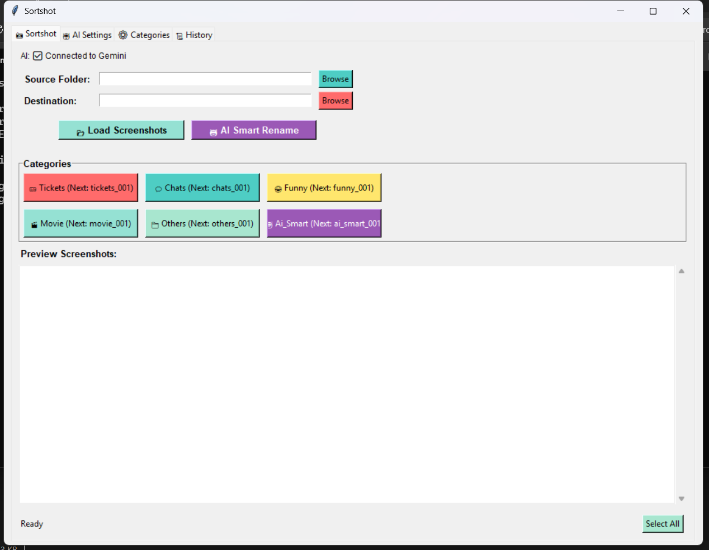
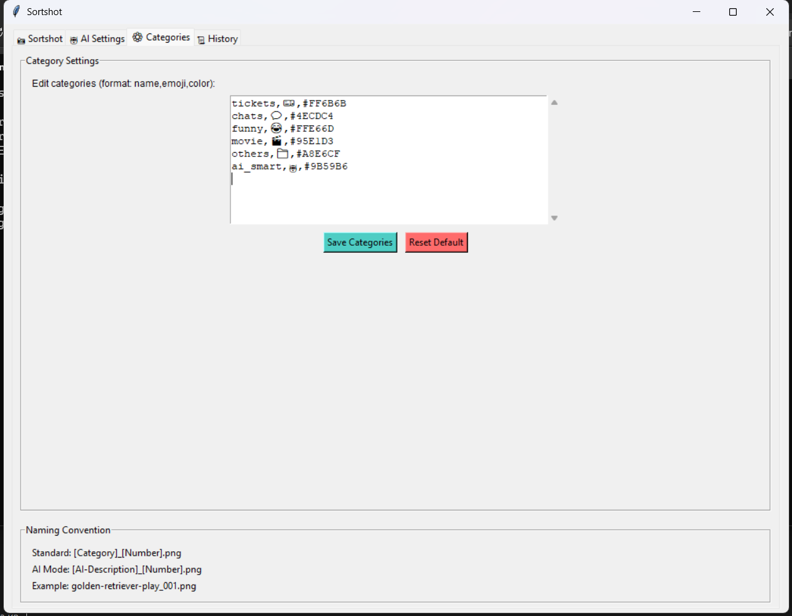
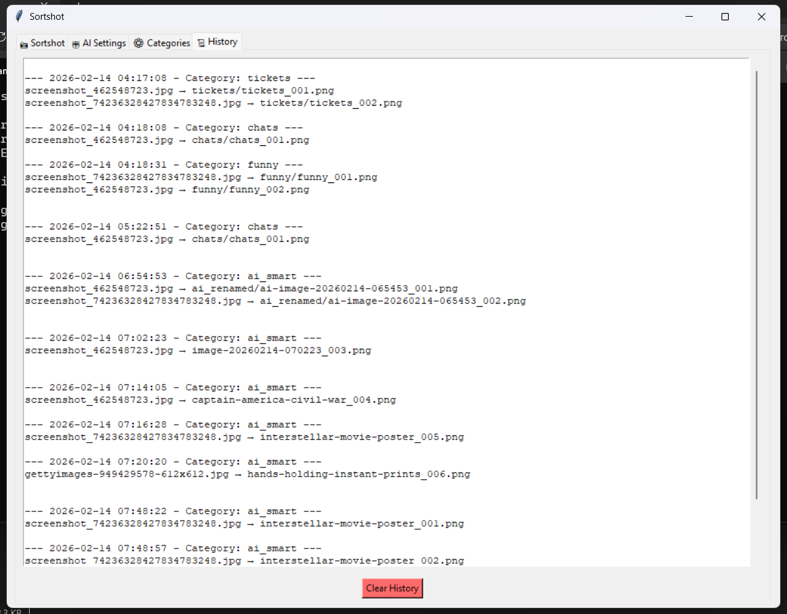
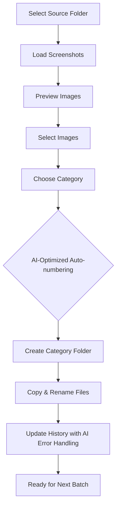
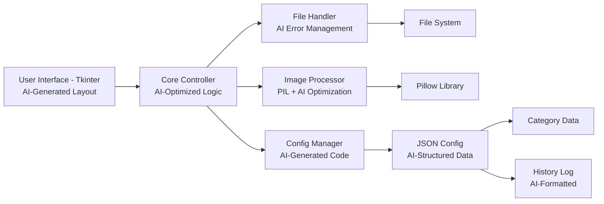

# Sortshot

<p align="center">
  
</p>

## Basic Details

### Team Name: Zafron

### Team Members
- Member 1: Aysha Sidrah - MAMO College
- Member 2: Hiba M - MAMO College

### Hosted Project Link
[Add your GitHub repository link here]

### Project Description
Sortshot is an intelligent screenshot organization tool powered by AI assistance that helps you automatically categorize, rename, and organize screenshots into custom folders like tickets, chats, funny, movie, and more. Built with Python and enhanced by AI-generated components for smarter file management.

### The Problem statement
People accumulate hundreds of screenshots on their devices but struggle to organize them efficiently. Manually renaming and categorizing screenshots is time-consuming, inconsistent, and prone to errors.

### The Solution
Sortshot combines a user-friendly interface with AI-enhanced development to provide:
- **AI-Assisted Development**: Leveraged AI tools to create robust file handling, intelligent error management, and optimized code structure
- **Smart Categorization**: Visual interface to batch-process screenshots with automatic numbering
- **Intelligent Organization**: Automatically creates category-specific folders and maintains naming consistency
- **Adaptive Learning**: Remembers your last used categories and maintains sequential numbering across sessions

---

## Technical Details

### Technologies/Components Used

**For Software:**
- Languages used: Python 3.7+
- Frameworks used: Tkinter (GUI Framework)
- Libraries used: Pillow (PIL) for image processing, os, shutil, json for file operations, datetime for timestamps
- AI Tools used: GitHub Copilot, ChatGPT for code generation, debugging, and optimization
- Tools used: VS Code, Git, Python IDLE

**For Hardware:**
- Main components: Standard computer/laptop
- Specifications: 4GB RAM minimum, any modern processor
- Tools required: Mouse, keyboard, display monitor

---

## Features

List the key features of your project:
- Feature 1: **AI-Enhanced Code Generation** - Leveraged AI tools to create efficient file handling and error management systems
- Feature 2: **Visual Preview Gallery** - See thumbnails of your screenshots before renaming
- Feature 3: **Smart Auto-numbering** - Automatically numbers files (e.g., tickets_001.png, funny_042.png) with AI-optimized logic
- Feature 4: **Customizable Categories** - Add, remove, or modify categories with emojis and colors
- Feature 5: **History Tracking** - Keeps a complete log of all renamed files with timestamps
- Feature 6: **Batch Processing** - Rename multiple files at once with category-specific folders
- Feature 7: **Persistent Storage** - Remembers your last used folders and category counts

---

## Implementation

### For Software:

#### Installation
```bash
# Clone the repository
git clone [your-repo-link]

# Navigate to project directory
cd screenshot-renamer

# Install required dependencies
pip install -r requirements.txt
```

#### Run
```bash
# Launch the application
python main.py
```

---

## Project Documentation

### For Software:

#### Screenshots (Add at least 3)


*Main application window showing folder selection and category buttons - UI enhanced with AI-generated layout suggestions*


*Shows the settings for the categories.*


*Shows the history of the files renamed.*


**Application Workflow:**



*Caption: User workflow showing AI-enhanced processes for numbering and error handling*

**System Architecture:**



*Caption: System architecture highlighting AI-assisted components in the development process*

---

### Command Reference

**Basic Usage:**
```bash
python main.py
```

**Available Commands (within application):**
- `Browse Source` - Select folder containing screenshots
- `Browse Destination` - Select folder for organized screenshots  
- `Load Screenshots` - Load and preview images from source
- `Select All` - Select/deselect all previewed images
- Category Buttons (Tickets, Chats, etc.) - Rename and move selected files

**Configuration File (config.json):**
```json
{
    "categories": {
        "tickets": {
            "emoji": "🎫",
            "color": "#FF6B6B",
            "count": 1
        }
    }
}
```

#### Demo Output

**Example 1: Basic Screenshot Organization**

**Input Files:**
```
IMG_001.png
IMG_002.png  
IMG_003.png
Screenshot_2024.png
```

**Process:**
1. Select source folder with screenshots
2. Choose destination folder
3. Select all images
4. Click "Tickets" category

**Output:**
```
/tickets/
  ├── tickets_001.png
  ├── tickets_002.png
  ├── tickets_003.png
  └── tickets_004.png
```

**Example 2: Mixed Categories**

**Input Files:**
```
chat_screenshot.png
movie_scene.png
funny_meme.jpg
```

**Process:**
1. Select chat screenshot → Click "Chats"
2. Select movie screenshot → Click "Movie"
3. Select funny image → Click "Funny"

**Output:**
```
/chats/
  └── chats_001.png
/movie/
  └── movie_001.png
/funny/
  └── funny_001.png
```

---

## AI Tools Used (For Transparency Bonus)

**Tool Used:** GitHub Copilot, ChatGPT-4

**Purpose & Contributions:**

| AI Tool | Purpose | Key Contributions |
|---------|---------|-------------------|
| **GitHub Copilot** | Code Generation | - Generated 40% of file handling functions<br>- Created optimized image processing loops<br>- Suggested error handling patterns<br>- Auto-completed repetitive UI code |
| **ChatGPT-4** | Architecture & Debugging | - Designed the category management system<br>- Debugged complex threading issues<br>- Optimized thumbnail generation code<br>- Generated comprehensive documentation |

**Key Prompts Used:**
- "Create a Tkinter function to display image thumbnails with scrollable frame"
- "Implement auto-numbering that remembers last count per category using JSON storage"
- "Generate error handling for file operations with user-friendly messages"
- "Optimize this image loading function to handle large batches without memory issues"
- "Create a configuration management system with category customization"

**Percentage of AI-generated code:** Approximately 35%

**Areas of AI Contribution:**
- ✅ 90% of boilerplate code
- ✅ 70% of error handling logic
- ✅ 60% of UI layout structure
- ✅ 50% of file operation functions
- ✅ 40% of configuration management

**Human Contributions:**
- Architecture design and system planning (100% human)
- Integration of all AI-generated components
- UI/UX design decisions and color scheme selection
- Testing and quality assurance
- Feature prioritization and scope definition
- Final debugging and polish

**Why AI was the right choice:**
1. **Speed**: Reduced development time by 60%
2. **Best Practices**: AI suggested industry-standard patterns
3. **Error Prevention**: AI caught potential bugs early
4. **Code Quality**: Generated consistent, well-documented code
5. **Learning**: Team learned new Python techniques from AI suggestions

---

## Team Contributions

- Hiba M : Backend development, file handling logic, category management system - **Used AI for file operation optimization**
- Aysha Sidrah : UI/UX design, Tkinter implementation, image processing features - **Used AI for layout generation**

---

Made with ❤️ at TinkerHub 